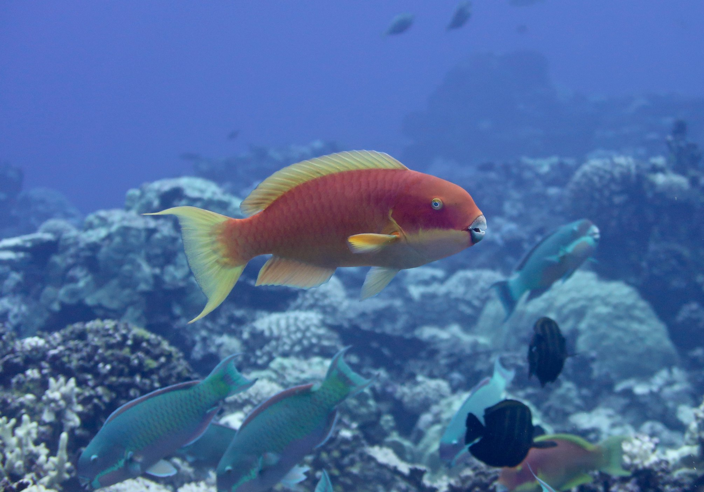
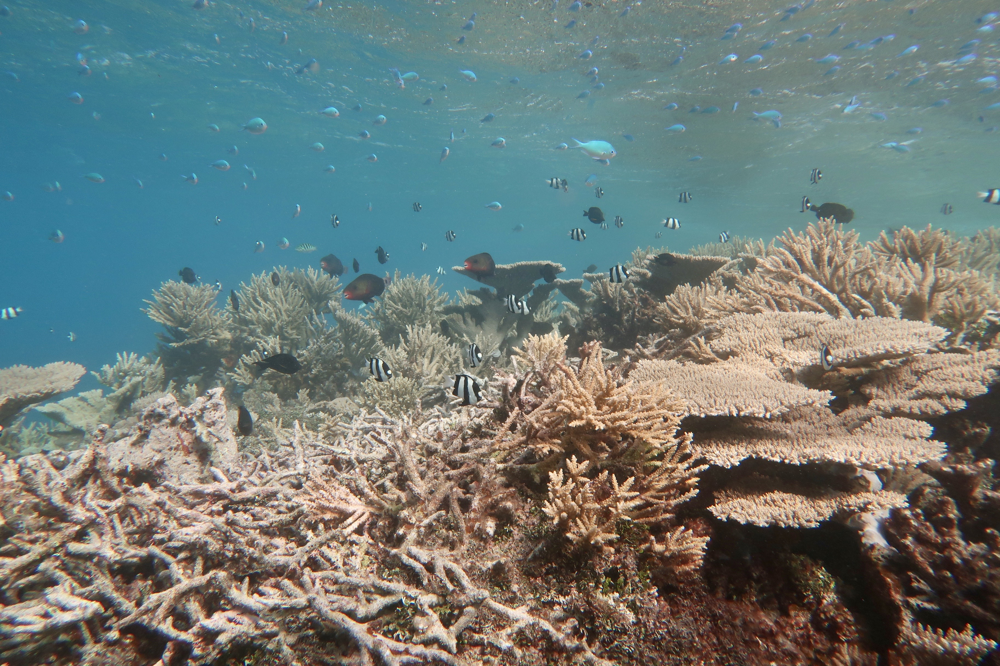

```{r, echo = F}
library(tidyverse)
```
# a. 2: Demo

```{r, echo = FALSE}
library(vembedr)
embed_url("https://youtu.be/kBz1K2s5s98")
```
<br>
<br>

# b. 2: Slides

You can access the full slideshow used in the **2-Tidyverse** narration **[here](https://simonjbrandl.github.io/mce_xaringan_slides/02-tidyverse.html)**.

The dataset called 'fishtibble.csv' can be downloaded [here](data/fishtibble.csv).

The dataset called 'coralreefherbivores.csv' can be downloaded [here](data/coralreefherbivores.csv).

The dataset called 'fish_abundance.csv' can be downloaded [here](data/fish_abundance.csv).
<br>
<br>

# c. 2: Exercises

Read in the coralreefherbivores.csv dataset (if you haven't already done so). 



The “coralreefherbivores.csv” dataset contains trait information on 93 species of herbivorous coral reef fishes from the Great Barrier Reef, Australia. The first four columns provide taxonomic information (family, genus, species, and a combined genus + species column called “genspe”). The next column “sl” indicates the standard length of the fish. Then, you have three columns with morphological measurements of body depth, snout length, and eye diameter. Finally, you have two columns that indicate maximum body size (categories from XS to XL) and their schooling behavior. 
<br>
<br>

### Part I

- a) Using the herbivore dataset, perform the following actions:
  - Determine the mean standard length and standard deviation for the families Acanthuridae, Labridae, and Siganidae. 
  - Create a variable that combines size and schooling into one column.
  - Examine the mean eye diameter of the genera Zebrasoma and Scarus.
  - Count the number of species in each size class.
  - Calculate the ratio of snout length to standard length for each species, then determine which genus has the longest mean ratio of snout length to standard length.
<br>
<br>

- learn about and apply the following functions:
  - <span style="color:orange"> *unite()* </span>
  - <span style="color:orange"> *separate()* </span>
  - <span style="color:orange"> *distinct()* </span>
  - <span style="color:orange"> *drop_na()* </span>
<br>
<br>



### Part II

The “fish_abundance.csv” dataset contains reef fish abundance information, which was collected by the Reef Life Survey around Lizard Island, Australia. It includes information on the respective survey ID and its metadata (e.g. site, latitude, longitude, date, and depth). It also includes a row for each observed species on a given visual survey, including taxonomic information (family, genus, species, and “genspe”), as well as the number of individuals observed on that survey (‘total’).

- a) Using the fish abundance dataset, perform the following actions:
  - Reveal how many distinct surveys were performed aruond Lizard Island.
  - In the family column, replace all occurrences of Scaridae with Labridae.
  - Filter the dataset to only retain the families Acanthuridae, Siganidae, Kyphosidae and Labridae.
  - Examine how many different species are in each genus.
  - Calculate the mean abundance of each genus across different sites using group_by() and summarize(), while also retaining a variable that indicates the number of species per genus.
<br>
<br>

- b) Using the herbivore trait dataset, perform the following actions:
  - Determine whether the median eye diameter differs between species in different social groups.
  - Remove the standard length, size, and schooling categories dataset.
  - Calculate the mean body depth, snout length, and eye diameter of each genus.
  - Turn each trait into a separate column.
<br>
<br>
  
- c) Combine the two datasets:
  - Join the coralreefherbivores and fish_abundance datasets in their modified versions, retaining only genera that are present in the coralreefherbivores dataset and using “genus” as the joining variable.
  - Create a new variable that separates genera into high (>=2.0) and low (<2.0) abundance genera
  - Examine whether high and low abundance genera differ in their mean morphological traits
<br>
<br>

# d. 2: Solutions

### Part I

a) 
- Using the herbivore dataset, perform the following actions:
  - Determine the mean standard length and standard deviation for the families Acanthuridae, Labridae, and Siganidae. 
  - Create a variable that combines size and schooling into one column.
  - Examine the mean eye diameter of the genera Zebrasoma and Scarus.
  - Count the number of species in each size class.
  - Calculate the ratio of snout length to standard length for each species, then determine which genus has the longest mean ratio of snout length to standard length.

```{r, echo = FALSE, results = FALSE}
herbivores <- read.csv(file = "data/coralreefherbivores.csv")
herbivores.filter <- herbivores %>% # mean sl and sd sl
  filter(family == c("Acanthuridae", "Labridae", "Siganidae")) %>%
  group_by(family) %>%
  summarize(mean.sl = mean(sl), sd.sl = sd(sl))
head(herbivores.filter)

herbivores.size_schooling <- herbivores %>%
  mutate(size_school = paste(size, schooling, sep = "."))
head(herbivores.size_schooling)

herbivores.size_schooling2 <- unite(herbivores, col = "size_and_schooling", c("size", "schooling"), sep = ".") #alternative solution


zebrasoma.scarus <- herbivores %>%
  filter(genus == c("Zebrasoma", "Scarus")) %>%
  group_by(genus) %>%
  summarize(mean.eye = mean(eyediameter))
head(herbivores.size_schooling2)

number.species <- herbivores %>% # solution 1
  select(size) %>%
  group_by(size) %>%
  count(size)
number.species

crh.d <- herbivores %>% group_by(size) %>% summarize(n_species = n_distinct(gen.spe))
crh.d

ratio <- herbivores %>%
  group_by(species) %>%
  mutate(ratio.snout.sl = (snoutlength/sl)) %>%
  arrange(desc(ratio.snout.sl))
head(ratio)
```

### Part II

a) 
- Using the fish abundance dataset, perform the following actions:
  - Reveal how many distinct surveys were performed around Lizard Island (SurveyID).
  - In the family column, replace all occurrences of Scaridae with Labridae.
  - Filter the dataset to only retain the families Acanthuridae, Siganidae, Kyphosidae and Labridae.
  - Examine how many different species are in each genus.
  - Calculate the mean abundance of each genus using group_by() and summarize(), while also retaining a variable that indicates the number of species per genus.

```{r, echo = FALSE, results = FALSE}
fish.abu <- read.csv(file = "data/fish_abundance.csv")

# how many surveys
surveys <- fish.abu %>%
  select(surveyid) %>% 
  distinct() # distinct gives yu the number of unique occurrences
nrow(surveys)

# replace Scaridae with Labridae
fish.abu.recode <- fish.abu %>%
  mutate(family = recode(family, "Scaridae" = "Labridae")) # use recode within mutate to change the family
head(fish.abu.recode)

# filter out families
fish.abu.filtered <- fish.abu.recode %>%
  filter(family %in% c("Acanthuridae", "Siganidae", "Labridae", "Kyphosidae")) # use filter - also works as family == c("")
head(fish.abu.filtered)

# count species in each genus
fish.species.counts <- fish.abu.filtered %>%
  group_by(genus) %>% # group by genus
  summarize(number.species = n_distinct(species)) # use n_distinct() to count the rows in each groups ;-) 
head(fish.species.counts)

# mean abundances and number of species
fish.genus.abundance <- fish.abu.filtered %>%
  group_by(genus) %>% # group by family and genus - important because we'll want family in this dataset
  summarize(mean.abu = mean(total), number.species = n_distinct(species)) # mean and n_distinct
head(fish.genus.abundance)
```

b) 
- Using the herbivore trait dataset, perform the following actions:
  - Determine whether the median eye diameter differs among different social groups.
  - Remove the standard length, size, and schooling categories dataset.
  - Calculate the mean body depth, snout length, and eye diameter of each genus.
  - Turn each trait back into a separate column.

```{r, echo = FALSE, results = FALSE}
# eye diameter
herbivore.eyes <- herbivores %>%
  group_by(schooling) %>% # group by scholing variable
  summarize(mean.eye = mean(eyediameter)) #summarize()
herbivore.eyes

herbivore.pruned <- herbivores %>%
  select(-sl, -size, -schooling) # use select to remove columns
head(herbivore.pruned)

# mean body depth, snout length, and eye diameter
herbivore.means <- herbivore.pruned %>%
  gather(5:7, key = "metric", value = "value") %>% # gather thre three morphometric columns into one
  group_by(genus, metric) %>% # group by
  summarize(mean.val = mean(value)) # get mean
head(herbivore.means)
  
# turn traits back into separate columns
herbivore.spread <- herbivore.means %>%
  spread(key = "metric", value = "mean.val") # use spread function
herbivore.spread
```

c)
- Combine the two datasets:
  - Join the coralreefherbivores and fish_abundance datasets in their modified versions, retaining only genera that are present in the coralreefherbivores dataset and using “genus” as the joining variable.
  - Create a new variable that separates genera into high (>=2.0) and low (<2.0) abundance genera
  - Examine whether high and low abundance genera differ in their mean morphological traits
  
```{r, echo = FALSE, results = FALSE}
herbivores.joined <- herbivore.spread %>%
  left_join(fish.genus.abundance, by = "genus") %>% # use left_join to retain the ones in the traits dataset
  drop_na(mean.abu) # remove NA values 
herbivores.joined

herbivores.joined.2 <- herbivores.joined %>%
  mutate(highvslow = case_when(mean.abu >=2 ~ "high", # use case_when function
                               TRUE ~ "low"))
herbivores.joined.2

herbivores.highlow <- herbivores.joined.2 %>%
  gather(2:5, key = "metric", value = "value") %>% # gathering to make it more efficient
  group_by(metric, highvslow) %>% # grouping
  summarize(mean.val = mean(value), # summarizing for mean and sd
            sd.val = sd(value))
herbivores.highlow
```