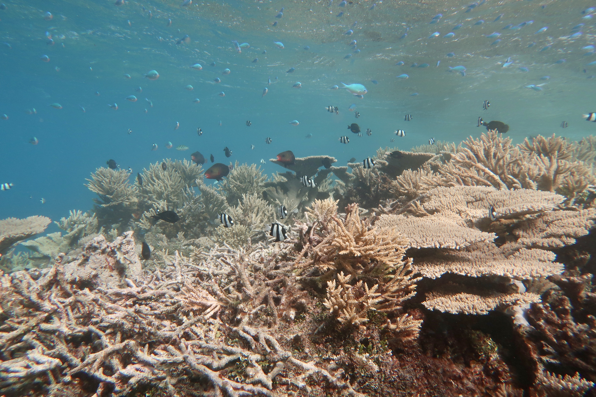

# Course synopsis
 
This course aims to provide students with a holistic understanding of the assembly and functioning of marine communities. Students will learn about existing and emerging theories and concepts in community ecology and gain insight into traditional and modern techniques to study marine communities, from visual censuses to molecular approaches.
 
 
The course includes quantitative training and practical components using the software R, designed to foster an understanding of basic statistical concepts in community ecology and their thoughtful implementation. No existing experience in R is required but familiarizing yourself with the software early on may be helpful (see resources below). 
 
 
The course includes two laboratory sessions to be held on Sat/Sun in February (02/16-02/17) and April (04/27-04/28) during which you will have an opportunity to engage in hands-on research on marine and estuarine communities. 

