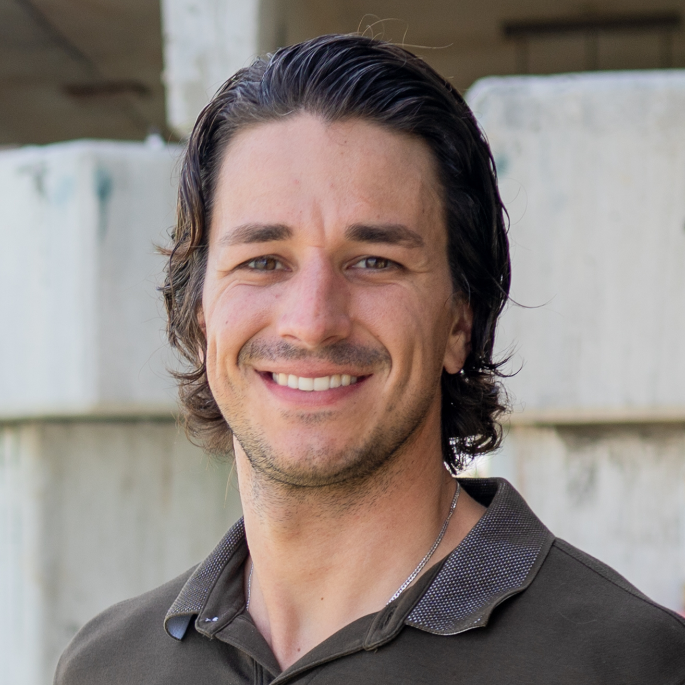
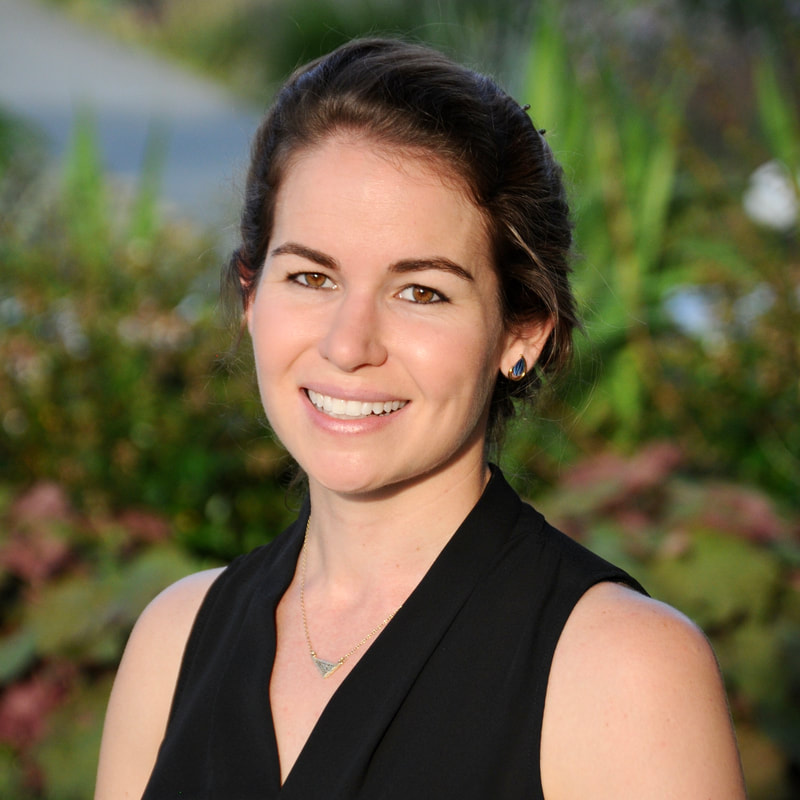

## Simon J. Brandl, PhD

Dr. Brandl is an Assistant Professor in Marine Science at the University of Texas at Austin Marine Science Institute. He maintains a [research program](www.fishandfunctions.com) that revolves around the causes and consequences of marine community assembly. Dr. Brandl originally developed this course in 2022. 

---

## Jordan M. Casey, PhD

Dr. Casey is also an Assistant Professor in Marine Science at the University of Texas at Austin Marine Science Institute. She examines [ecological communities and trophic interactions](https://caseylab.weebly.com/) among species using molecular techniques. Dr. Casey refined the course materials in 2023. 

